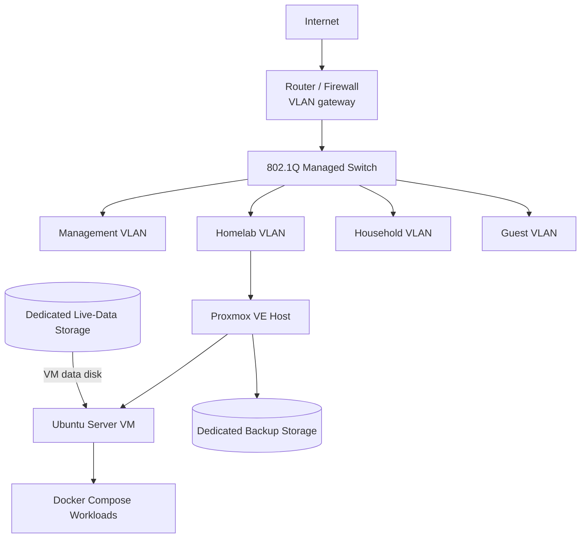

# Infrastructure Homelab

A sanitized portfolio representation of a personal infrastructure environment used to develop practical experience with Linux administration, virtualisation, networking, containerisation, storage, backup automation, monitoring, and troubleshooting.

The environment began as a bare-metal Ubuntu Server host and was migrated to Proxmox VE. The current design separates the hypervisor from an Ubuntu Server workload VM, keeps live application data on separate storage, and uses layered backup workflows for application state, Proxmox configuration, and the VM operating-system disk.

> **Portfolio scope:** this repository is deliberately curated. Hostnames, addresses, paths, identifiers, and other environment-specific values have been generalized. Raw logs, credentials, full inventories, and unrelated application configuration are intentionally excluded.

## What this project demonstrates

- **Linux administration:** Ubuntu Server, filesystems, mounts, SSH, systemd, services, and troubleshooting.
- **Virtualisation:** migration from bare-metal Ubuntu Server to Proxmox VE and operation of a Linux VM.
- **Networking:** 802.1Q VLAN segmentation, static addressing, Linux bridges, reverse-proxy ingress, and remote administration.
- **Containers:** Docker and Docker Compose as the application workload layer.
- **Storage and reliability:** separation of OS, live-data, and backup storage with mount guards and dependency controls.
- **Automation:** Bash backup workflows with readiness checks, error handling, validation, retention, and service recovery behaviour.
- **Troubleshooting:** documented investigation of an Intel `e1000e` NIC fault, storage mount ordering, and a boot-time backup readiness race triggered by persistent systemd timers.

## Architecture at a glance

The public examples use documentation-only addresses such as `10.10.20.0/24`; they are not the live environment's addressing.

## Key engineering work

### Bare-metal to Proxmox migration

The original Ubuntu Server host ran Docker services directly on the hardware. Before replacing that installation, I inventoried the host, identified persistent container data, created and verified an off-host migration backup, installed Proxmox VE, created an Ubuntu Server VM, and restored the retained services. See [Migration: bare-metal Ubuntu to Proxmox VE](docs/migration.md).

### Layered backup design

The current environment uses three complementary backup scopes:

1. **Application state** — Compose configuration, application data, and Docker volumes.
2. **Proxmox configuration** — a consistent `pmxcfs` database snapshot plus selected host configuration.
3. **VM operating-system disk** — Proxmox `vzdump`; the large live-data disk is deliberately excluded from this layer.

The custom Bash workflows perform prerequisite/readiness checks, use incomplete-work directories, validate compressed archives, generate checksums, and apply generation-based retention. Recovery validation has included an isolated VM OS restore/boot, a representative application-state restore, and non-destructive Proxmox-configuration extraction/integrity checks. See [Backup and recovery design](docs/backup-recovery.md) and the [sanitized scripts](scripts/).

### Reliability controls

Docker workloads depend on a separately mounted data filesystem. A systemd drop-in uses `RequiresMountsFor=` and explicit ordering so Docker does not start against an absent data disk. See [Case study: storage mount ordering](docs/case-studies/storage-mount-ordering.md).

### Backup boot readiness

Persistent systemd timers exposed a startup race when missed backup schedules were caught up immediately after host boot. Journal timing isolated the dependency problem; systemd ordering and bounded command-level readiness checks were added, and the missed-schedule boot condition was deliberately reproduced to validate the fix. See [Case study: persistent systemd timer boot-readiness race](docs/case-studies/backup-boot-readiness.md).

### Network troubleshooting

A Proxmox host experienced repeated Intel `e1000e` hardware-hang events. Kernel logs were used to isolate the failure pattern, TCP segmentation offload was disabled as a workaround, and the setting was made persistent in the host network configuration. No further hardware-hang events appeared in the subsequently captured logs. See [Case study: Intel `e1000e` hardware hangs](docs/case-studies/nic-hardware-hangs.md).

## Environment snapshot

| Area | Current portfolio snapshot |
|---|---|
| Hypervisor | Proxmox VE 9.2.x |
| Workload OS | Ubuntu Server 26.04 LTS |
| Containers | Docker Engine / Docker Compose |
| Network | VLAN-segmented home network with managed switching |
| Reverse proxy | Caddy-managed HTTPS ingress |
| Remote administration | Tailscale |
| Monitoring | Uptime Kuma |
| Automation | Bash + systemd |

## Repository map

| Path | Purpose |
|---|---|
| [`docs/architecture.md`](docs/architecture.md) | Compute, storage, networking, and service architecture |
| [`docs/migration.md`](docs/migration.md) | Bare-metal Ubuntu → Proxmox migration case study |
| [`docs/backup-recovery.md`](docs/backup-recovery.md) | Backup layers, safeguards, validation, and current limitations |
| [`docs/case-studies/`](docs/case-studies/) | Focused troubleshooting and reliability case studies, including boot-time backup readiness |
| [`scripts/`](scripts/) | Sanitized, publication-oriented versions of deployed backup automation |
| [`configs/`](configs/) | Selected sanitized configuration examples |
| [`docs/publication-notes.md`](docs/publication-notes.md) | Sanitization and evidence boundaries |

## Current limitations

This is a **single-host personal environment**, not enterprise production infrastructure. It does not implement clustered Proxmox, high availability, enterprise identity, or multi-site failover.

Backup creation, integrity checks, and representative recovery paths have been tested, including an isolated VM OS restore and boot. A complete bare-metal replacement-host disaster-recovery exercise has not been performed, and the large live-data disk remains intentionally outside the VM OS backup layer. See [Backup and recovery design](docs/backup-recovery.md).

## Why this repository is curated

The private project repository functions as an engineering notebook and contains detailed operational history. This public repository is instead intended to show the architecture, decisions, automation, and troubleshooting that are most relevant to infrastructure and systems work. It is not a dump of the live environment.
