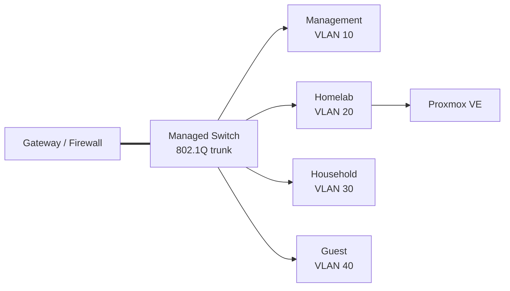

# Architecture

## Design goals

The homelab is designed around four practical goals:

1. separate the hypervisor from application workloads;
2. segment management, lab, household, and guest traffic;
3. separate operating-system, live-data, and backup storage;
4. make common failure states observable and recoverable rather than relying on manual memory.

This document uses sanitized addresses and generic device names. The values are representative of the architecture, not the live environment.

## Network

The network uses a gateway/firewall and an 802.1Q managed switch. A trunk carries the active VLANs between them; access ports place wired devices into the appropriate network.

| VLAN | Example subnet | Purpose |
|---:|---|---|
| 10 | `10.10.10.0/24` | Management devices |
| 20 | `10.10.20.0/24` | Proxmox host and lab workloads |
| 30 | `10.10.30.0/24` | Normal household devices |
| 40 | `10.10.40.0/24` | Guest internet access |

The management network is the highest-trust segment. Guest traffic is isolated. The homelab and household networks are allowed to communicate where required for local service consumption.



The Proxmox host uses a Linux bridge (`vmbr0`) with a static address on the homelab network. The Ubuntu workload VM is attached to that bridge using a VirtIO network interface.

Selected examples:

- [`configs/proxmox-networking.interfaces.example`](../configs/proxmox-networking.interfaces.example)
- [`configs/ubuntu-netplan.example.yaml`](../configs/ubuntu-netplan.example.yaml)

## Compute and virtualisation

The current compute design is deliberately small:

```text
x86 host
└── Proxmox VE
    └── Ubuntu Server VM
        └── Docker Compose workloads
```

The workload VM currently uses 4 vCPUs, 4 GiB RAM, a 32 GiB operating-system disk, and a separate large virtual disk for application data.

The move to Proxmox created a clean separation between the physical host and the application operating system. It also made the VM operating-system disk independently backupable without duplicating the much larger live-data disk.

## Storage

Storage is split by responsibility rather than placed on a single filesystem.

```mermaid
flowchart TB
    NVME[(Host / VM OS storage)]
    LIVE[(Live-data storage)]
    BKP[(Backup storage)]
    PVE[Proxmox VE]
    VM[Ubuntu Server VM]
    APP[/srv/library]

    NVME --> PVE
    PVE --> VM
    LIVE -->|separate VM data disk| VM
    VM --> APP
    PVE --> BKP
```

| Layer | Purpose |
|---|---|
| Host / VM OS storage | Proxmox installation and VM system disk |
| Live-data storage | Large application-data disk presented to the VM |
| Guest mount | Application data mounted at `/srv/library` |
| Backup storage | Dedicated filesystem for application-state, Proxmox-configuration, and VM backups |

The large live-data disk is deliberately excluded from the VM OS backup. Application state is backed up separately so the backup scope matches the data's role instead of blindly duplicating the entire disk.

Proxmox storage definitions use `is_mountpoint 1` for the dedicated live-data and backup paths. The backup scripts also explicitly verify that the backup filesystem is mounted before writing anything. This reduces the risk of accidentally writing a backup into an unmounted directory on the root filesystem.

Selected example: [`configs/proxmox-storage.cfg.example`](../configs/proxmox-storage.cfg.example).

## Container workload layer

The Ubuntu VM is the Docker Compose host. Multiple self-hosted applications run there, but the individual applications are not the focus of this portfolio. They act as realistic workloads for practising:

- persistent volumes and bind mounts;
- container networking;
- reverse proxying;
- monitoring;
- upgrades and lifecycle management;
- backup and restore design.

A Caddy container terminates HTTPS and proxies selected services to internal upstreams. Only HTTP/HTTPS ingress is forwarded from the Internet; application ports are not intentionally forwarded directly.

## Mount dependency control

Many containers use data stored under `/srv/library`. If Docker starts while that filesystem is absent, a bind mount can resolve to an ordinary empty directory and make an application appear freshly configured.

A systemd drop-in makes the storage dependency explicit:

```ini
[Unit]
RequiresMountsFor=/srv/library
After=srv-library.mount
```

The active systemd configuration and mounted filesystem were captured and the behaviour was verified after reboot. See [Case study: storage mount ordering](case-studies/storage-mount-ordering.md).

## Remote access and monitoring

Tailscale is installed on the Ubuntu VM for authenticated remote administration. It is used as a host-access mechanism rather than a subnet router.

Uptime Kuma monitors selected application endpoints. This is useful operational visibility for a personal environment, but it is not presented as enterprise observability.

## Security and scope boundaries

The public repository intentionally does not contain:

- real internal or public hostnames;
- live IP addressing;
- MAC addresses, UUIDs, or device serials;
- credentials, SSH keys, browser/session data, or API values;
- full firewall/router exports;
- raw operational logs;
- full Docker Compose or application configuration dumps.

See [Publication notes](publication-notes.md) for the sanitization model.
