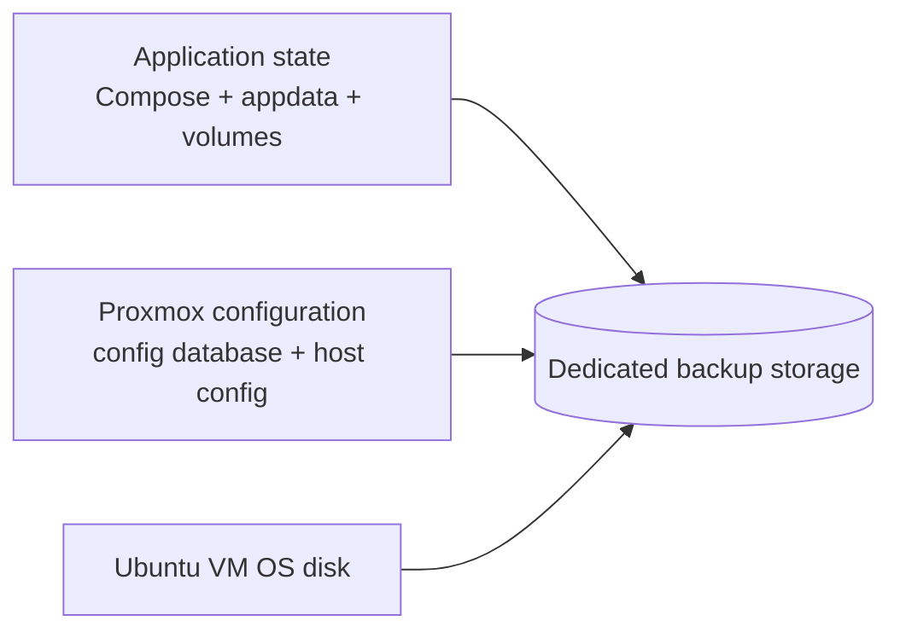

# Backup and recovery design

## Design objective

Back up the state required to reconstruct the environment without blindly duplicating all live content.

The design separates three scopes because they have different recovery purposes.



## Backup layers

| Layer | Schedule in live environment | Configured retention | Validation demonstrated |
|---|---|---:|---|
| Application state | Daily | 14 generations | Checksums/archive tests + representative state restore |
| Proxmox configuration | Weekly | 8 generations | SQLite/checksum/archive validation + isolated extraction |
| Ubuntu VM OS disk | Weekly | 4 backups | Proxmox `vzdump` + isolated restore and boot |
| Large media/content data | Excluded | — | Intentional scope decision |

The timer schedule remains environment-specific and is not published as a turnkey unit. The relevant boot-readiness controls are documented below and in [the persistent-timer case study](case-studies/backup-boot-readiness.md).

## Application-state backup

The application-state workflow runs from the Proxmox host and accesses the Ubuntu VM over SSH.

The deployed design performs the following sequence:

1. verify that the dedicated backup filesystem is actually mounted;
2. wait for the Ubuntu VM's SSH service to become reachable, using a bounded retry loop;
3. create a timestamped `.incomplete-*` working directory only after readiness succeeds;
4. capture source and container metadata;
5. record which containers are currently running;
6. stop those containers for a consistent application-state capture;
7. archive Compose configuration;
8. archive application data while excluding selected cache data;
9. export Docker volume contents;
10. restart the containers, including recovery behaviour through an `EXIT` trap;
11. create SHA-256 checksums;
12. test each compressed archive;
13. verify the checksums;
14. atomically rename the incomplete working directory to the final generation;
15. prune generations beyond configured retention.

A sanitized publication-oriented version is available at [`scripts/app-state-backup.sh`](../scripts/app-state-backup.sh).

### Why readiness comes before the incomplete directory

A failed run should not look like a complete backup generation. Work is written beneath a `.incomplete-*` path and promoted only after validation succeeds.

A boot-time failure exposed an additional refinement: the working directory should not be created before the remote VM is reachable. Persistent systemd timers can catch up a missed run immediately after host boot, while the guest is still starting. The live workflow now waits for SSH readiness first, so this expected transient state does not leave a stale incomplete directory.

## Proxmox configuration backup

The Proxmox configuration workflow captures both metadata and configuration state.

Before creating a generation, the workflow uses bounded readiness checks against the Proxmox commands required by the backup (`pvesm status` and the target VM configuration). This prevents a persistent timer from racing early host startup.

The deployed implementation then creates a consistent SQLite snapshot of the Proxmox cluster filesystem database and performs:

```sql
PRAGMA integrity_check;
```

before accepting it as valid.

The public version uses a narrow allowlist for host configuration files and intentionally excludes SSH private keys and other credential material. See [`scripts/pve-config-backup.sh`](../scripts/pve-config-backup.sh).

## VM OS backup

The Ubuntu VM uses two virtual disks:

- a smaller operating-system disk;
- a much larger data disk backed by dedicated live-data storage.

The data disk is deliberately marked `backup=0` in the VM definition for the Proxmox VM-backup layer. That prevents the weekly OS backup from duplicating the large application-data disk, which is handled through the separate application-state design.

This is a scope decision rather than an assumption that every attached disk belongs in every backup layer.

## Boot-readiness failure and validation

The captured journals exposed a reliability issue when persistent timers had missed their normal schedules while the host was off. On reboot, systemd immediately attempted catch-up runs before the Ubuntu VM or some Proxmox services were ready.

The application-state job failed on SSH connectivity before the VM had completed startup. The Proxmox-configuration job separately failed because required Proxmox services were not yet ready. Both failures were safe, but they meant a missed schedule could remain missed after boot.

The correction combined two controls:

- systemd ordering against the relevant host/guest startup units;
- bounded command-level readiness checks inside the backup scripts.

The missed-schedule condition was then deliberately reproduced and the host rebooted. During the validation boot:

- the Proxmox-configuration job waited for required Proxmox commands to become available and completed successfully;
- the application-state job waited approximately 15 seconds for guest SSH readiness and then completed successfully;
- both services ended with `Result=success` and `ExecMainStatus=0`;
- the prior stale `.incomplete-*` remnants were reviewed and removed.

See [Case study: persistent systemd timer boot-readiness race](case-studies/backup-boot-readiness.md).

## Scoped recovery validation

Backup creation and archive integrity are useful only if the resulting artifacts can also be consumed. A non-destructive recovery exercise therefore tested one representative path from each backup layer.

### VM OS restore

A recent `vzdump` archive was restored to a temporary, unused VM ID on separate VM storage. Before first boot:

- automatic start was disabled;
- the network interface was removed;
- the installation ISO was removed;
- the excluded live-data disk was confirmed not to be attached.

The restored VM booted successfully from the recovered OS disk. QEMU guest-agent checks confirmed Ubuntu 26.04 LTS, the expected root filesystem, the Docker installation, retained Compose configuration, a running systemd state, and no failed units. The `/srv/library` live-data mount was absent as expected because that disk is deliberately excluded from this backup layer.

The temporary restore VM and its disk were then removed.

### Representative application-state restore

A backed-up Uptime Kuma Docker volume was extracted to an isolated temporary path. Its recovered `kuma.db` file was recognised as SQLite, `PRAGMA integrity_check` returned `ok`, and the recovered database contained 23 tables.

This validates a representative application-state recovery path without replacing or modifying the live volume.

### Proxmox configuration recovery artifact

A successful Proxmox-configuration generation was validated non-destructively by:

- running `PRAGMA integrity_check` against the backed-up `config.db` (`ok`);
- extracting the compressed host-configuration archive into a temporary path;
- confirming expected network/host configuration and backup scripts were present;
- confirming the dedicated application-backup SSH private key was not present in the archive.

This demonstrates that the backup can be independently extracted and inspected as recovery input for a replacement host.

## Current limitations

### Full bare-metal disaster recovery is not claimed

The recovery exercises above are deliberately scoped. A complete reconstruction of the physical Proxmox host from bare metal, including every storage layer and service, has not been performed.

Accordingly, this project is described as having **tested backup creation, integrity validation, and representative recovery paths** — not fully validated disaster recovery.

### Large live-data recovery is outside this VM-backup layer

The large live-data disk is intentionally excluded from the VM OS backup. The VM restore test therefore validates the operating-system layer, not a duplicate of all live content.

### Offsite/encrypted recovery copy

The current design uses local dedicated backup storage. Encrypted offsite backup of critical state remains a future hardening task.

## Recovery principle

The project now distinguishes four levels of evidence:

- **Backup creation:** demonstrated.
- **Archive/database integrity checking:** demonstrated.
- **Representative scoped recovery:** demonstrated.
- **Complete bare-metal disaster recovery:** not claimed.

Keeping those claims separate is intentional.
