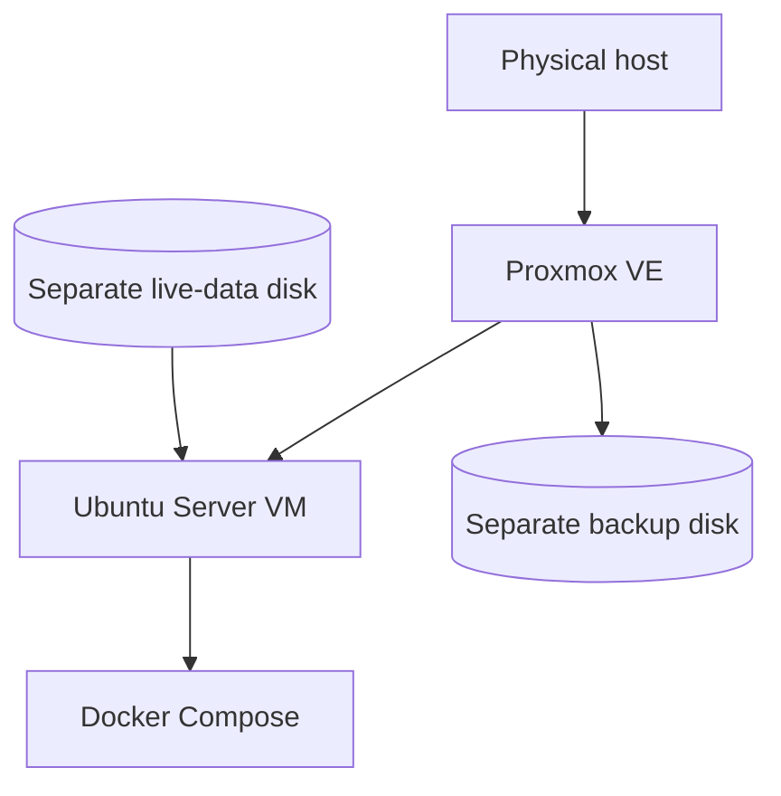

# Migration: bare-metal Ubuntu Server to Proxmox VE

## Objective

Move an existing Docker-based Ubuntu Server homelab from bare metal to Proxmox VE while preserving the retained services and their persistent data.

The goal was not simply to reinstall the same applications. The migration introduced a cleaner separation between the physical host, workload operating system, live application data, and backup storage.

## Starting state

Before migration, the server ran Ubuntu Server directly on the hardware and hosted three retained Docker services. Persistent state was spread across:

- Docker Compose files;
- bind-mounted directories;
- named and anonymous Docker volumes;
- container metadata useful for reconstruction.

The pre-migration inventory identified the data that had to survive the host rebuild before Proxmox was installed.

## Pre-migration backup

A migration archive was created before replacing the bare-metal Ubuntu installation. It included:

- retained Compose configuration;
- bind-mounted service data;
- Docker volume exports;
- container inspect metadata.

The archive was then copied off the server to another machine.

Validation performed before proceeding included:

- listing the main archive successfully;
- checking that the expected directory structure and files were present;
- test-extracting the archive;
- confirming individual Docker volume archives were readable;
- confirming an off-host copy existed.

This reduced the risk of making the destructive hypervisor change without a verified copy of the workload state.

## Target architecture

The initial VM was provisioned with:

| Resource | Allocation |
|---|---:|
| vCPU | 4 |
| RAM | 4 GiB |
| OS disk | 32 GiB |
| Data disk | 800 GiB |

The Ubuntu VM was configured with the QEMU guest agent, Docker Engine, and Docker Compose before the retained services were restored.

## Migration sequence

1. Inventory the bare-metal host and persistent Docker state.
2. Create and validate the migration backup.
3. Copy the backup off-host.
4. Install Proxmox VE on the physical server.
5. Configure host networking and storage.
6. Create the Ubuntu Server VM.
7. Attach the separate live-data disk.
8. Install the guest agent, Docker Engine, and Docker Compose.
9. Restore retained Compose configuration and persistent state.
10. Recreate and validate the services.

## Result

The retained services were restored inside the Ubuntu VM and the environment subsequently expanded there.

The migration produced several operational improvements:

- the physical host and workload OS are separated;
- the VM operating-system disk can be backed up independently;
- large live data can remain outside the VM OS backup scope;
- host-level and guest-level failure modes can be handled separately;
- future workloads can be added without returning to a single bare-metal application host.

## Evidence boundary

The migration backup was archive-tested and used as the preservation point before the host rebuild. A later recovery exercise successfully restored and booted the VM operating-system backup in an isolated temporary VM, but this should not be confused with complete bare-metal disaster recovery of the Proxmox host and every storage layer.
